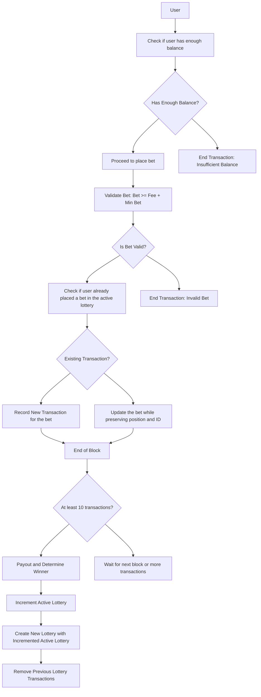

# cosmoslottery
**cosmoslottery** is a blockchain built using Cosmos SDK and Tendermint and created with [Ignite CLI](https://ignite.com/cli).

# Requirements
- [Ignite CLI](https://ignite.com/cli).
- go1.19.7

# How to
- `ignite chain serve --verbose`
- In new tab run:
  - `sudo chmod +x ./scripts/bet.bash`
  - `./scripts/bet.bash`

# Lottery System Architecture Overview

## **Primary Features:**

1. **Unique Transactions**: The system ensures that if a user submits multiple lottery transactions, only the most recent one is considered valid.
2. **Efficient Data Management**: The system provides quick look-up and set operations for handling user transactions.
3. **Aggregate Data Accessibility**: Enables O(1) access for the sum of all bets, the smallest bet, and the largest bet.

## **Architecture**:

### Components

### ActiveLottery
- **Purpose**: Refers to the current or ongoing lottery round, managed by the blockchain. The active lottery state is represented as `item` in `db`.
- **Incrementing ActiveLottery**: means new lottery round, starts from 1.  

### LotteryTransactionMetadata
- **Purpose**: An in-memory data structure designed to manage lottery transactions.
- **Methods**:
    - *Set*: Updates or inserts a new lottery transaction into the metadata, adjusting the total bet sum and setting the min/max bet values.
    - *Prune*: Resets the LotteryTransactionMetadata to its default state.
    - *RemoveLotteryTransactionId*: Handles the removal of a user's transaction and updates relevant attributes.

## **Design Decisions**:

1. **Efficiency**: Leveraged in-memory data structures like maps for O(1) access. However, the trade-off is increased memory consumption.
2. **Data Integrity**: By only allowing the most recent transaction from a user, we prevent double-counting.
3**Data Serialization**: Used string serialization (`encodeBet` and `decodeBet` methods) for efficient storage and retrieval of bet data.

## **Potential Enhancements**:

1. **Data Persistence**: Implement a system for periodic data backup or implement an LSM-tree data structure to enhance data persistence.
2. **Synchronization**: If scaling to a distributed setup, ensuring consistency across nodes could be a challenge that needs addressing.
3. **Validation**: More comprehensive validation mechanisms for ensuring data integrity.

# Chart
